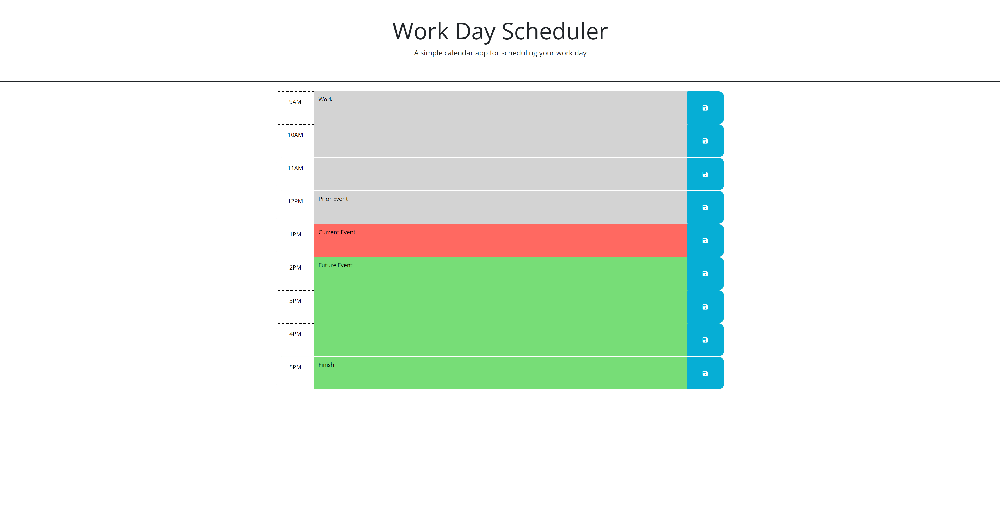

# Jakebs-Work-Scheduler
A repository for a web-based work scheduler for your 9-5.

## About this Repository
This repository is a repository for a web-based work scheduler for a 9-5 work day, it is the week 5 challenge for the Monash University Bootcamp.
* **When the user opens the planner they are shown the current date and time in the header.**
* **The user is able to see the timeblocks for the day and each time block is colour coded to show whether the associated hour is in the past (grey), present (red) or future (green).**
* **When the user clicks inside the timeblock they are able to input text.**
* **When the user clicks the save button for that timeblock the input is saved to the users' local storage.**
* **When the user refreshes the page, the user' prior schedule is pulled from local storage and displayed exactly as the user left it.**

## Challenges
The main challenge I faced in this project was actually something remarkably simple in hind sight, I really struggled to figure out a way to select specific division that the button click event originated in, in the end I opted to hard code each button with it's own event listener until I finished the rest of the project. Other than that I found this far easier than the [Questionnaire challenge](https://jakebjackson.github.io/Jakebs-Web-Questionnaire/) from last week and really enjoyed making it.

## About the project
The project is a scheduler for a typical work day (9am-5pm) and aims to utilise localstorage to keep the users inputs and redisplay them upon revisit, while also using DayJS to update the website in real-time.

## Mock-Up
Below is an image of the deployed application (The mockup is missing the date and time as I adjusted the webpage for the screenshot):

## Deployment
This application has been deployed [here](https://jakebjackson.github.io/Jakebs-Work-Scheduler/)https://jakebjackson.github.io/Jakebs-Work-Scheduler/).

